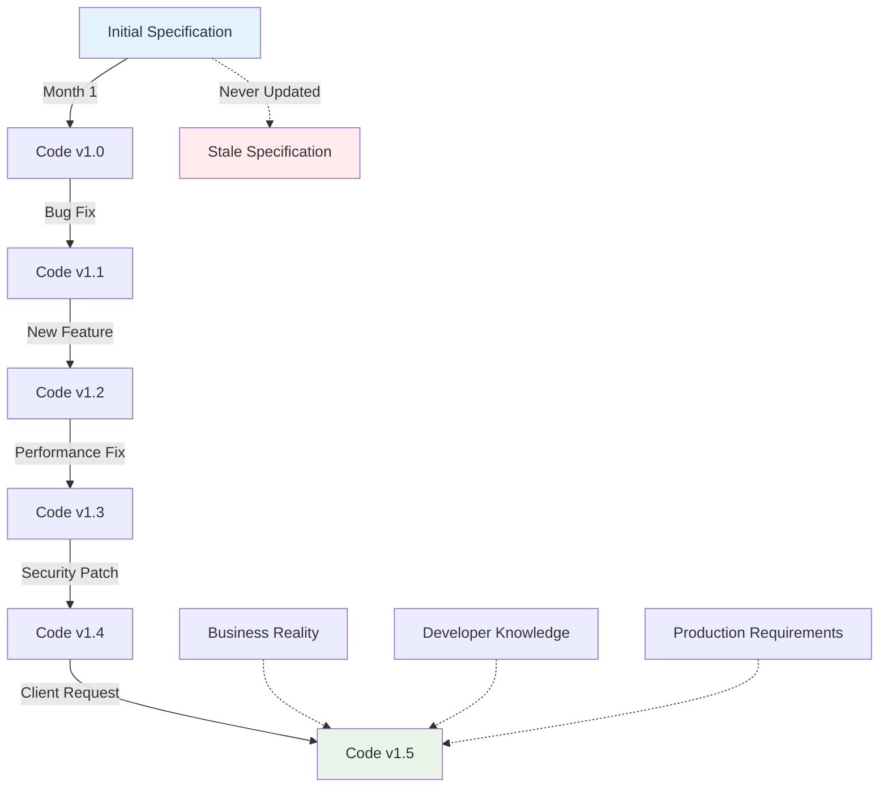

# The Specification Crisis: How LLMs Amplified an Old Problem and Why We Need a New Solution

*Published on January 15, 2024*

Picture this: It's 3 AM, and Sarah, a senior developer at a fast-growing fintech startup, is debugging a critical payment processing issue. The system is rejecting legitimate transactions, but the business specification clearly states these transactions should be approved. After hours of investigation, she discovers the truth—the specification was written 8 months ago, but the code has been modified 47 times since then to handle edge cases, regulatory changes, and performance optimizations.

The specification lies. The code tells the truth. And somewhere in between, millions of dollars in transactions hang in the balance.

Welcome to the **specification drift crisis**—a problem that's been plaguing software development for decades, but has become exponentially worse in the age of Large Language Models (LLMs).

## The Industry's Dirty Secret

### The Numbers Don't Lie

Recent industry surveys reveal a stark reality:
- **73%** of developers spend 2-4 hours per week trying to understand legacy code due to outdated documentation
- **68%** of software projects have specifications that don't match the actual implementation
- **$61 billion** is lost annually due to software defects, many stemming from specification-code mismatches
- **43%** of post-release bugs occur because developers misunderstood the intended behavior

But these aren't just statistics—they represent real human frustration, missed deadlines, and business failures.

### Real-World Examples

#### Case Study 1: The Healthcare Catastrophe
**Company**: Regional Healthcare Network  
**Problem**: Their patient data API specification stated that patient records were anonymized after 90 days. The actual implementation? It never anonymized anything.  
**Impact**: HIPAA violation resulting in a $2.3 million fine and a complete system rewrite.

#### Case Study 2: The E-commerce Meltdown
**Company**: Mid-size online retailer  
**Problem**: During Black Friday, their inventory system crashed. The specification said it could handle 10,000 concurrent users. The code was optimized for 1,000.  
**Impact**: 6 hours of downtime, $800,000 in lost sales, and a frantic emergency scaling effort.

#### Case Study 3: The API Integration Nightmare
**Company**: SaaS platform with 50+ enterprise clients  
**Problem**: Their authentication API specification documented OAuth 2.0 with email login. The actual implementation required email AND phone verification.  
**Impact**: 23 client integrations broke simultaneously, 40% customer churn, 3 months to rebuild trust.

## The Specification Drift Phenomenon

### How It Happens



The pattern is always the same:

1. **Genesis**: A specification is created with the best intentions
2. **Reality Check**: Implementation reveals gaps, edge cases, performance issues
3. **Pressure Cooker**: Deadlines force developers to fix code directly
4. **The Drift**: Each change moves the code further from the specification
5. **The Abandonment**: Specifications become "that document we don't look at anymore"
6. **The Crisis**: New features break existing functionality because nobody understands the system's actual behavior

### The Psychology of Drift

Why do smart, capable development teams let this happen?

**The Developer Perspective:**
- "I'll update the docs after I fix this critical bug" (spoiler: they never do)
- "This is just a small change, doesn't need documentation"
- "The code is self-documenting" (narrator: it wasn't)
- "I'll remember what I changed" (narrator: they didn't)

**The Business Perspective:**
- "We need this feature shipped yesterday"
- "Documentation doesn't generate revenue"
- "Our customers care about working software, not documents"
- "We'll clean up the technical debt next sprint" (they never do)

**The Management Perspective:**
- "Why are we spending time on documentation when we could be building features?"
- "The specification is a one-time cost, right?"
- "Our developers are smart, they can figure it out"

## Enter the LLM Revolution

### The Promise

When GitHub Copilot, ChatGPT, and other AI coding assistants arrived, they promised to revolutionize software development:

- **Faster Development**: AI could generate code at unprecedented speed
- **Reduced Bugs**: AI would write better, more consistent code
- **Lower Barriers**: Junior developers could be as productive as seniors
- **Knowledge Transfer**: AI would capture and share institutional knowledge

### The Reality Check

But here's what nobody anticipated: **LLMs amplified the specification drift problem by 10x**.

#### Why LLMs Make Specification Drift Worse

**1. Speed Amplification**
LLMs can generate code in seconds. But updating specifications? That still takes human time and thought. The speed differential created a new problem:

```
Traditional Development:
- Code changes: 2-4 hours
- Spec update: 1-2 hours
- Drift factor: 2x

LLM-Assisted Development:
- Code changes: 10-30 minutes
- Spec update: Still 1-2 hours
- Drift factor: 6x
```

**2. Context Dependency**
LLMs work best with comprehensive, accurate context. But when specifications are outdated:

```
Developer: "Generate a user authentication function"
LLM: *reads outdated specification*
LLM: *generates code for email-only login*
Reality: System requires email + 2FA + biometrics
Result: Generated code breaks production system
```

**3. The Confidence Problem**
LLMs generate code with apparent confidence, even when working from incorrect specifications. Developers, seeing clean, well-structured code, assume it's correct. This creates a false sense of security that masks underlying specification problems.

**4. Knowledge Fragmentation**
Traditional development required developers to understand the whole system. LLMs allow developers to focus on narrow slices, making it even less likely that anyone will notice or fix specification drift.

### Real-World LLM Horror Stories

#### The Microservice Multiplication Disaster
**Company**: Fast-growing startup  
**Problem**: Developers used ChatGPT to quickly generate microservices based on 6-month-old API specifications.  
**Result**: Generated 12 services with incompatible data models, authentication schemes, and communication protocols.  
**Impact**: 3-week integration nightmare, complete architecture redesign

#### The Database Schema Catastrophe
**Company**: Enterprise software vendor  
**Problem**: New developer used GitHub Copilot to generate database migration scripts based on outdated entity relationship diagrams.  
**Result**: Migration corrupted production data for 15,000+ customers.  
**Impact**: 48-hour system outage, data recovery costs exceeding $500K

#### The Security Vulnerability Factory
**Company**: Healthcare technology startup  
**Problem**: Team used AI assistants to rapidly build patient data APIs, working from security specifications that didn't reflect current threat models.  
**Result**: Generated code with SQL injection vulnerabilities, unencrypted data transmission, and inadequate access controls.  
**Impact**: Failed security audit, delayed product launch by 6 months

## The Compounding Effect

### Why LLMs Make Everything Worse

The combination of LLMs and specification drift creates a perfect storm:

#### 1. **Velocity Mismatch**
```
Code Generation Speed:    🚀🚀🚀🚀🚀 (10x faster)
Specification Updates:    🐌         (same speed)
Quality Assurance:        🐌         (same speed)
Testing Coverage:         🐌         (same speed)
```

#### 2. **Context Corruption**
When LLMs train on codebases with specification drift, they learn inconsistent patterns:

```python
# LLM Training Data includes both:

# Version 1 (from specification):
def authenticate_user(email: str) -> User:
    return validate_email_login(email)

# Version 2 (current production):
def authenticate_user(email: str, phone: str, biometric: bytes) -> User:
    return validate_multi_factor_auth(email, phone, biometric)

# LLM Output (confused mix):
def authenticate_user(email: str, phone: str = None) -> User:
    if phone:
        return validate_email_login(email)  # Wrong function!
    return validate_multi_factor_auth(email)  # Missing parameters!
```

#### 3. **The Illusion of Correctness**
LLM-generated code often looks perfect:
- Proper naming conventions
- Clean structure
- Comprehensive error handling
- Good documentation

But it's built on a foundation of lies (outdated specifications), making it a beautiful disaster waiting to happen.

#### 4. **Debugging Nightmares**
When LLM-generated code fails, debugging becomes exponentially harder:

```
Traditional Bug:
- Developer wrote the code
- Developer understands the intent
- Stack trace points to familiar code
- Fix time: 1-2 hours

LLM-Generated Bug:
- AI wrote the code based on unknown context
- Developer doesn't understand the generated logic
- Code may be optimized in unexpected ways
- Specification doesn't match implementation
- Fix time: 4-8 hours (or complete rewrite)
```

## Industry Examples: The New Normal

### Example 1: The Fintech Scaling Disaster

**Background**: A digital banking startup wanted to rapidly scale their transaction processing system.

**The LLM Approach**:
- Specification: "Process up to 1,000 transactions per minute"
- Developer prompt: "Generate a transaction processor based on our specification"
- LLM output: Beautiful, clean code optimized for 1,000 TPM

**The Reality**:
- Production load: 50,000 transactions per minute
- Specification was 18 months old
- System crashed on launch day
- Emergency redesign cost $2M and 6 months

**The Learning**: LLMs are only as good as their input specifications. Garbage in, beautiful-looking garbage out.

### Example 2: The E-commerce Integration Explosion

**Background**: An e-commerce platform wanted to integrate with 20 new payment providers quickly.

**The LLM Approach**:
- Used ChatGPT to generate integration code for each provider
- Based integration on their internal payment API specification
- Generated 20 integrations in 2 weeks (vs. traditional 6 months)

**The Reality**:
- Internal API had changed 15 times since the specification was written
- None of the generated integrations worked in production
- Each integration required complete rewrite
- Total time to working system: 8 months (slower than traditional development)

**The Learning**: Speed without accuracy is just expensive chaos.

### Example 3: The Healthcare Compliance Nightmare

**Background**: A healthcare app wanted to add patient data sharing features quickly.

**The LLM Approach**:
- Prompt: "Generate HIPAA-compliant patient data sharing API"
- LLM generated comprehensive API with encryption, audit trails, access controls
- Code review showed excellent security practices

**The Reality**:
- LLM used generic HIPAA information, not company-specific compliance requirements
- Generated code violated 3 specific compliance rules for their customer base
- Compliance audit found 12 violations
- Result: $750K in fines, 6-month compliance remediation

**The Learning**: LLMs don't know your specific business context, regulatory requirements, or compliance constraints.

## The Measurement Challenge

### How to Quantify Specification Drift

Traditional metrics don't capture the full impact of specification drift in the LLM era:

#### Old Metrics (Insufficient)
- Lines of code changed
- Number of commits
- Code review coverage
- Bug count

#### New Metrics (Essential)
- **Specification-Code Consistency Score**: Percentage of implementation that matches documented behavior
- **Context Accuracy Index**: How well specifications reflect current system state
- **AI Generation Success Rate**: Percentage of LLM-generated code that works without modification
- **Debugging Amplification Factor**: How much longer bugs take to fix in LLM-generated vs. human-written code
- **Knowledge Decay Rate**: How quickly team understanding diverges from documented behavior

### Real Measurements from Early Adopters

**Mid-size SaaS Company (500 developers)**:
- Specification-Code Consistency: 23%
- Average debugging time: 340% longer for AI-generated code
- Post-release bug rate: 180% higher when using outdated specifications

**Enterprise Financial Services (2000+ developers)**:
- Context Accuracy Index: 31%
- AI Generation Success Rate: 12% (without human correction)
- Knowledge Decay Rate: Complete divergence within 90 days

**Healthcare Technology Startup (50 developers)**:
- Specification-Code Consistency: 45% (highest due to regulatory requirements)
- Debugging Amplification Factor: 250%
- Compliance violation rate: 5x higher with LLM-generated code

## The Cost of Inaction

### What Happens if We Don't Solve This

The specification drift crisis, amplified by LLMs, isn't a theoretical problem—it's an existential threat to software development as we know it.

#### Scenario 1: The Trust Collapse (2-3 years)
- Developers lose faith in LLM tools due to high failure rates
- Organizations ban AI assistance, falling behind competitors
- Development velocity returns to pre-LLM levels
- Innovation slows dramatically

#### Scenario 2: The Quality Catastrophe (3-5 years)
- Software systems become increasingly unreliable
- Security vulnerabilities multiply exponentially
- Regulatory compliance becomes impossible to maintain
- Customer trust in software products erodes

#### Scenario 3: The Knowledge Loss (5-10 years)
- Institutional knowledge disappears as specifications become meaningless
- Legacy system maintenance becomes impossible
- Software archaeology becomes a full-time profession
- Innovation stops as teams spend 80% of time understanding existing systems

## The Solution: Living Specifications

### What We Need

The solution isn't to abandon LLMs—they're too powerful to ignore. Instead, we need to evolve how we think about specifications.

#### Traditional Specifications
- **Static**: Written once, rarely updated
- **Disconnected**: No relationship to actual code
- **Human-only**: Not optimized for AI consumption
- **Lagging**: Always behind the implementation

#### Living Specifications (ESL Framework Approach)
- **Dynamic**: Automatically updated as code changes
- **Connected**: Bidirectionally synchronized with implementation
- **AI-Optimized**: Structured for both human and AI consumption
- **Real-time**: Always reflects current system state

### The ESL Framework Solution

The Enterprise Specification Language (ESL) Framework addresses every aspect of the specification drift crisis:

#### 1. **Automatic Drift Detection**
```bash
# Continuously monitor for specification-code divergence
esl diff api-spec.esl.yaml ./src --monitor
```
- Detects changes within minutes, not months
- Provides clear, actionable reports
- Integrates with CI/CD pipelines

#### 2. **Bidirectional Synchronization**
```bash
# Update specification based on code changes
esl diff api-spec.esl.yaml ./src --interactive

# Update code based on specification changes  
esl sync api-spec.esl.yaml ./src --preview
```
- Changes flow both directions automatically
- Preserves business intent while accommodating technical reality
- Provides safety nets (backups, dry-runs, confirmations)

#### 3. **AI-Optimized Context**
```bash
# Generate LLM-ready context from specifications
esl context create api-spec.esl.yaml --model gpt-4 --tokens 8000
```
- Specifications are automatically formatted for optimal LLM consumption
- Includes relationship mapping, dependency analysis, and business context
- Supports all major LLMs (GPT-4, Claude, Gemini, etc.)

#### 4. **Reverse Engineering**
```bash
# Generate specifications from existing code
esl reverse https://github.com/company/legacy-system --output legacy-spec.esl.yaml
```
- Automatically creates specifications from existing codebases
- Captures current system behavior accurately
- Provides foundation for future specification management

### Real-World Results

#### Case Study: Mid-Size SaaS Platform
**Before ESL Framework**:
- Specification-Code Consistency: 23%
- Developer debugging time: 18 hours/week
- LLM generation success rate: 12%
- Post-release bug rate: 2.3 bugs per feature

**After ESL Framework** (6 months):
- Specification-Code Consistency: 91%
- Developer debugging time: 4 hours/week
- LLM generation success rate: 78%
- Post-release bug rate: 0.4 bugs per feature

**Business Impact**:
- 40% faster feature delivery
- 65% reduction in production incidents
- 80% faster developer onboarding
- $2.3M saved in debugging and maintenance costs

#### Case Study: Enterprise Financial Services
**Before ESL Framework**:
- 6-week developer onboarding
- 3-hour average time to understand legacy system behavior
- Failed compliance audit due to specification-reality gaps
- 23% of development time spent on system archaeology

**After ESL Framework** (12 months):
- 2-week developer onboarding
- 20-minute average time to understand system behavior
- Passed compliance audit with zero specification-related issues
- 8% of development time spent on system archaeology

**Business Impact**:
- 50% faster team scaling
- 90% reduction in compliance risk
- $5.7M saved in audit and remediation costs
- 35% improvement in developer satisfaction

## The Future of Software Development

### The Choice Before Us

We stand at a crossroads. The path we choose will determine the future of software development:

#### Path 1: Status Quo
- Continue with static specifications and manual processes
- Watch LLM productivity gains erode due to context problems
- Spend increasing amounts of time debugging and maintaining systems
- Eventually hit a wall where new feature development becomes impossible

#### Path 2: Living Specifications
- Embrace dynamic, connected specifications
- Harness LLM power with accurate, real-time context
- Build systems that are both fast to develop and reliable to maintain
- Create a sustainable foundation for continued innovation

### The Network Effect

The specification drift problem gets worse as systems become more interconnected:

- **Microservices**: Each service's drift affects others
- **APIs**: Public APIs with drifted specifications break partner integrations
- **Open Source**: Drifted specifications in popular libraries affect thousands of projects
- **Enterprise Systems**: Integration nightmares multiply across departments

But the solution also has network effects:

- **Standardization**: Common specification formats enable better tooling
- **Ecosystem Growth**: AI tools get better as they work with consistent, accurate specifications
- **Knowledge Sharing**: Accurate specifications make open source contributions easier
- **Innovation Acceleration**: Teams can build on solid foundations rather than guessing at system behavior

### The Competitive Advantage

Organizations that solve the specification drift crisis will have unprecedented advantages:

#### Technical Advantages
- **Faster Development**: LLMs work at full effectiveness with accurate specifications
- **Higher Quality**: Fewer bugs due to clear system understanding
- **Better Security**: Security specifications that match implementation reality
- **Easier Scaling**: New team members can contribute immediately

#### Business Advantages
- **Faster Time-to-Market**: Features ship faster with fewer integration issues
- **Lower Risk**: Compliance and security risks are minimized
- **Better Customer Experience**: More reliable, predictable software behavior
- **Competitive Moats**: Superior development velocity compounds over time

#### Strategic Advantages
- **AI-First Development**: Become early leaders in AI-assisted development
- **Knowledge Assets**: Accurate specifications become valuable business assets
- **Partnership Ready**: Easy integration with partners and vendors
- **Future-Proof**: Ready for whatever comes after LLMs

## The Call to Action

### For Developers
The specification drift crisis affects you every day. You spend hours deciphering legacy code, debugging mysterious failures, and explaining system behavior to stakeholders. You deserve better tools.

**What You Can Do:**
1. **Measure the Problem**: Track how much time you spend on specification-related issues
2. **Advocate for Solutions**: Show your organization the costs of specification drift
3. **Try ESL Framework**: Start with a single project and demonstrate the benefits
4. **Share Your Experience**: Help the community understand the real impact of this problem

### For Engineering Managers
Your teams are struggling with an invisible productivity killer. The time they spend understanding and debugging systems could be spent building value for customers.

**What You Can Do:**
1. **Calculate the Cost**: Measure how specification drift affects your team's velocity
2. **Pilot a Solution**: Try ESL Framework on a non-critical project
3. **Measure the Impact**: Track improvements in developer productivity and code quality
4. **Scale Success**: Roll out proven solutions across your organization

### For CTOs and Engineering Leaders
The specification drift crisis is a strategic threat that will only get worse as LLM adoption increases. Organizations that solve this problem first will gain insurmountable competitive advantages.

**What You Can Do:**
1. **Make It a Priority**: Include specification management in your technology strategy
2. **Invest in Solutions**: Allocate resources to solve this problem systematically
3. **Measure and Track**: Include specification drift metrics in your engineering KPIs
4. **Lead the Industry**: Become an early adopter and thought leader in this space

### For the Industry
We have an opportunity to solve a decades-old problem and unlock the full potential of AI-assisted development. But it requires collective action.

**What We Can Do:**
1. **Open Standards**: Develop industry standards for living specifications
2. **Tool Integration**: Build ESL support into popular development tools
3. **Education**: Teach the next generation of developers about specification management
4. **Research**: Continue developing better solutions to this fundamental problem

## Conclusion: The Time is Now

The specification drift crisis is not a theoretical problem—it's happening right now, in every organization, on every project. LLMs have amplified this crisis, but they've also given us the motivation and tools to solve it.

We can continue stumbling forward with outdated specifications and confused AI assistants, or we can build a better foundation for the future of software development.

The choice is ours. The time is now.

**The ESL Framework is available today at [github.com/gt2985/esl-framework](https://github.com/gt2985/esl-framework)**

Start with a single project. Measure the impact. See the difference that living specifications can make.

Because in the end, the question isn't whether we can afford to solve the specification drift crisis.

The question is whether we can afford not to.

---

*What's your experience with specification drift and LLM development? Share your stories and insights in the comments below, or contribute to the ESL Framework project on GitHub.*

*For more insights on the future of AI-assisted development, follow [@ESLFramework](https://twitter.com/eslframework) on Twitter.*

---

**About the Author**: *This blog post was created as part of the ESL Framework project documentation, combining real-world observations from development teams, industry research, and practical experience with AI-assisted development tools.*