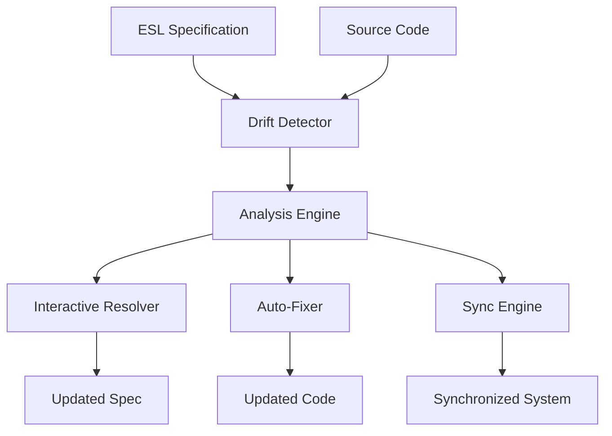

# Bidirectional Synchronization

The ESL Framework's **Bidirectional Synchronization Service** is a comprehensive solution that eliminates the "spec drift" problem by maintaining perfect synchronization between ESL specifications and source code.

## Table of Contents

- [Overview](#overview)
- [The Spec Drift Problem](#the-spec-drift-problem)
- [Architecture](#architecture)
- [Phase 1: Drift Detection](#phase-1-drift-detection)
- [Phase 2: Interactive Resolution](#phase-2-interactive-resolution)
- [Phase 3: Spec-to-Code Sync](#phase-3-spec-to-code-sync)
- [Advanced Features](#advanced-features)
- [Best Practices](#best-practices)
- [Troubleshooting](#troubleshooting)

## Overview

Bidirectional Synchronization ensures that your ESL specifications and code remain in perfect harmony throughout the development lifecycle. The system can detect discrepancies, suggest fixes, and even automatically apply changes in both directions.

### Key Capabilities

- **🔍 Drift Detection**: Automatically identify when spec and code diverge
- **🔄 Interactive Resolution**: Guided fixing of specification drift
- **⚡ Automatic Fixes**: Batch application of safe changes
- **🛡️ Safety Mechanisms**: Dry-run, backup, and confirmation prompts
- **📊 Detailed Reports**: Comprehensive analysis with actionable insights

## The Spec Drift Problem

### What is Spec Drift?

Spec drift occurs when:
1. Initial code is generated from an ESL specification
2. Developers modify the code directly during development
3. The specification becomes outdated and inconsistent with the actual code
4. Business intent and technical reality diverge

### Real-World Example

```yaml
# Original ESL Specification
dataModels:
  User:
    properties:
      id: { type: string }
      name: { type: string }
      email: { type: string }
```

```typescript
// Code after developer modifications
export interface User {
  id: string;
  name: string;
  email: string;
  // Added by developer
  createdAt: Date;
  isActive: boolean;
  // Removed: age property that was in spec
}
```

This creates **specification drift** where the business specification no longer matches the technical implementation.

## Architecture

The bidirectional synchronization system uses **Abstract Syntax Trees (ASTs)** to understand and modify code structures safely.

### Core Components



### Technology Stack

- **TypeScript Compiler API**: For AST parsing and manipulation
- **YAML Parser**: For specification processing
- **Inquirer.js**: For interactive user prompts
- **Chalk**: For colored output and reporting

## Phase 1: Drift Detection

### Command Usage

```bash
# Basic drift detection
esl diff my-spec.esl.yaml ./src

# Detailed output
esl diff my-spec.esl.yaml ./src --verbose

# JSON output for CI/CD
esl diff my-spec.esl.yaml ./src --format json
```

### Detection Capabilities

#### Model Drift Detection

```bash
# Example output
🔍 ESL Drift Report:
Found 5 drift issues

📊 Model Drift:
❌ Model 'Product' found in spec but not in code
⚠️  Model 'User' found in code but not in spec
❌ Property 'User.age' (number) found in spec but not in code
⚠️  Property 'User.createdAt' (Date) found in code but not in spec
🔄 Property 'User.email' type mismatch: expected string, got EmailAddress
```

#### Service Drift Detection

```bash
🔧 Service Drift:
❌ Service 'UserService' found in spec but not in code
⚠️  Service 'AuthService' found in code but not in spec
❌ Method 'UserService.createUser' found in spec but not in code
⚠️  Method 'UserService.deleteUser' found in code but not in spec
🔄 Method 'UserService.updateUser' has parameter mismatch
```

### Drift Types

| Type | Description | Icon | Severity |
|------|-------------|------|----------|
| `missing_model` | Model in spec but not in code | ❌ | Error |
| `extra_model` | Model in code but not in spec | ⚠️ | Warning |
| `missing_property` | Property in spec but not in code | ❌ | Error |
| `extra_property` | Property in code but not in spec | ⚠️ | Warning |
| `type_mismatch` | Property type differs | 🔄 | Error |
| `missing_service` | Service in spec but not in code | ❌ | Error |
| `extra_service` | Service in code but not in spec | ⚠️ | Warning |
| `missing_method` | Method in spec but not in code | ❌ | Error |
| `extra_method` | Method in code but not in spec | ⚠️ | Warning |
| `parameter_mismatch` | Method parameters differ | 🔄 | Warning |

### CI/CD Integration

```yaml
# GitHub Actions example
name: Drift Detection
on: [push, pull_request]
jobs:
  check-drift:
    runs-on: ubuntu-latest
    steps:
      - uses: actions/checkout@v3
      - uses: actions/setup-node@v3
        with:
          node-version: '18'
      - run: npm install -g esl-framework
      - run: esl diff specs/api.esl.yaml ./src
        continue-on-error: true
      - run: echo "Drift detected - see logs above"
        if: failure()
```

## Phase 2: Interactive Resolution

### Interactive Mode

```bash
# Launch interactive drift resolution
esl diff my-spec.esl.yaml ./src --interactive
```

### Interactive Workflow

```bash
🔧 Interactive Drift Resolution
Found 3 fixable issues. Do you want to review and fix them? (Y/n) y

Fix: Property 'User.age' (number) found in spec but not in code? (Y/n) y
  ✅ Fixed

Fix: Property 'User.createdAt' (Date) found in code but not in spec? (Y/n) y
  ✅ Fixed

Fix: Service 'UserService' found in spec but not in code? (Y/n) n
  ⏭️ Skipped

🎉 Fixed 2 out of 3 issues
```

### Automatic Application

```bash
# Apply all fixable issues automatically
esl diff my-spec.esl.yaml ./src --apply
```

```bash
🔧 Auto-fixing drift issues...
✅ Applied fixes to 5 issues
  • Added property 'User.age' to specification
  • Updated property 'User.email' type in specification
  • Added service 'AuthService' to specification
  • Added method 'UserService.deleteUser' to specification
  • Updated method 'UserService.updateUser' parameters in specification
```

### Fix Types

#### Code-to-Spec Fixes

When the code is more recent than the specification:

```bash
# What gets fixed
✅ Add missing models to specification
✅ Add missing properties to specification
✅ Add missing services to specification
✅ Add missing methods to specification
✅ Update property types in specification
```

#### Spec-to-Code Fixes

When the specification is the source of truth:

```bash
# What gets fixed (in Phase 3)
✅ Generate missing models in code
✅ Add missing properties to code
✅ Generate missing services in code
✅ Add missing methods to code
✅ Update property types in code
```

## Phase 3: Spec-to-Code Sync

### Sync Command

```bash
# Synchronize code with specification
esl sync my-spec.esl.yaml ./src
```

### Sync Workflow

```bash
🔄 Sync Plan:
📄 3 files to create:
  + ./src/models/product.ts
    Create model Product
  + ./src/services/productservice.ts
    Create service ProductService
  + ./src/controllers/productcontroller.ts
    Create controller ProductController

✏️ 2 files to modify:
  🟡 ./src/models/user.ts
    Update model User
  🟡 ./src/services/userservice.ts
    Update service UserService

📊 Summary:
  Models: 2
  Services: 2
  Endpoints: 1
  Total changes: 5

⚠️ 1 high-risk changes detected
   Review these changes carefully before applying

Apply 5 changes to sync code with specification? (y/N) y
```

### Safety Features

#### Dry Run

```bash
# Preview changes without applying
esl sync my-spec.esl.yaml ./src --dry-run
```

#### Backup

```bash
# Create backups before modifying
esl sync my-spec.esl.yaml ./src --backup
```

#### Risk Assessment

Changes are categorized by risk level:

- **🟢 Low Risk**: Adding new optional properties
- **🟡 Medium Risk**: Modifying existing properties
- **🔴 High Risk**: Removing properties or changing types

### Code Generation

#### Generated TypeScript Models

```typescript
/**
 * User model
 * Auto-generated from ESL specification
 */
export interface User {
  /** User ID */
  id: string;
  /** User name */
  name: string;
  /** User email */
  email: string;
  /** User age */
  age?: number;
  /** User active status */
  isActive?: boolean;
}

export default User;
```

#### Generated Services

```typescript
/**
 * UserService service
 * Auto-generated from ESL specification
 */
export class UserService {
  /**
   * Create a new user
   */
  async createUser(userData: User): Promise<User> {
    throw new Error('Method not implemented');
  }

  /**
   * Get user by ID
   */
  async getUserById(id: string): Promise<User> {
    throw new Error('Method not implemented');
  }
}

export default UserService;
```

#### Generated Controllers

```typescript
/**
 * UsersController controller
 * Auto-generated from ESL specification
 */
export class UsersController {
  /**
   * POST /api/users
   */
  async postUsers(userData: User): Promise<User> {
    throw new Error('Endpoint not implemented');
  }

  /**
   * GET /api/users/:id
   */
  async getUsersId(id: string): Promise<User> {
    throw new Error('Endpoint not implemented');
  }
}

export default UsersController;
```

## Advanced Features

### Custom Templates

```bash
# Use custom code generation templates
esl sync my-spec.esl.yaml ./src --template ./custom-templates
```

### Selective Sync

```bash
# Sync only specific types
esl sync my-spec.esl.yaml ./src --include models,services
esl sync my-spec.esl.yaml ./src --exclude controllers
```

### Merge Strategies

```bash
# Different merge strategies for conflicts
esl sync my-spec.esl.yaml ./src --strategy merge    # Merge changes
esl sync my-spec.esl.yaml ./src --strategy replace  # Replace entirely
esl sync my-spec.esl.yaml ./src --strategy skip     # Skip conflicts
```

### Batch Operations

```bash
# Process multiple specifications
esl sync specs/*.esl.yaml ./src --batch
```

### Rollback

```bash
# Rollback last sync operation
esl sync --rollback
```

## Best Practices

### 1. Regular Drift Checks

Include drift checks in your development workflow:

```bash
# Add to package.json
"scripts": {
  "check-drift": "esl diff specs/api.esl.yaml ./src",
  "fix-drift": "esl diff specs/api.esl.yaml ./src --interactive",
  "sync-code": "esl sync specs/api.esl.yaml ./src --dry-run"
}
```

### 2. Git Integration

```bash
# Create git hooks for drift detection
# .git/hooks/pre-commit
#!/bin/bash
npm run check-drift
if [ $? -ne 0 ]; then
  echo "Drift detected. Please fix before committing."
  exit 1
fi
```

### 3. Staged Sync

For large projects, sync incrementally:

```bash
# 1. Dry run first
esl sync my-spec.esl.yaml ./src --dry-run

# 2. Apply with backup
esl sync my-spec.esl.yaml ./src --backup

# 3. Test changes
npm test

# 4. Commit if successful
git add .
git commit -m "Sync code with specification"
```

### 4. Team Collaboration

```bash
# Share drift reports with team
esl diff my-spec.esl.yaml ./src --format json > drift-report.json

# Include in PR descriptions
esl diff my-spec.esl.yaml ./src --format markdown >> pr-body.md
```

### 5. Documentation

```bash
# Generate documentation after sync
esl generate documentation my-spec.esl.yaml -o ./docs
```

## Troubleshooting

### Common Issues

#### 1. False Positives

```bash
# Ignore specific files or patterns
esl diff my-spec.esl.yaml ./src --ignore "**/*.test.ts,**/*.spec.ts"
```

#### 2. Complex Types

```bash
# For complex TypeScript types not in spec
esl diff my-spec.esl.yaml ./src --allow-complex-types
```

#### 3. Large Projects

```bash
# Process incrementally
esl diff my-spec.esl.yaml ./src --max-files 50
```

#### 4. Performance Issues

```bash
# Enable caching
esl diff my-spec.esl.yaml ./src --cache

# Use parallel processing
esl diff my-spec.esl.yaml ./src --parallel
```

### Error Recovery

#### Sync Failures

```bash
# If sync fails, restore from backup
esl sync --restore-backup ./src.backup.20240101

# Or rollback specific files
esl sync --rollback-file ./src/models/user.ts
```

#### Corrupted State

```bash
# Reset to clean state
esl sync --reset ./src
esl sync my-spec.esl.yaml ./src --force
```

### Debug Mode

```bash
# Enable debug output
DEBUG=esl:sync esl sync my-spec.esl.yaml ./src --verbose
```

## Configuration

### Project Configuration

```yaml
# .eslrc.yaml
sync:
  # Default sync options
  defaultOptions:
    backup: true
    dryRun: false
    force: false
    
  # File patterns to ignore
  ignore:
    - "**/*.test.ts"
    - "**/*.spec.ts"
    - "**/node_modules/**"
    
  # Risk thresholds
  riskThresholds:
    high: 0.8
    medium: 0.5
    
  # Code generation settings
  codeGeneration:
    addComments: true
    preserveExisting: true
    formatOutput: true
```

### Global Configuration

```bash
# Set global defaults
esl config set sync.backup true
esl config set sync.confirmDestructive true
esl config set sync.maxFiles 100
```

## Integration Examples

### GitHub Actions

```yaml
name: Bidirectional Sync
on:
  push:
    branches: [main]
  pull_request:
    branches: [main]

jobs:
  sync-check:
    runs-on: ubuntu-latest
    steps:
      - uses: actions/checkout@v3
      - uses: actions/setup-node@v3
        with:
          node-version: '18'
      - run: npm install -g esl-framework
      
      # Check for drift
      - name: Check Drift
        run: esl diff specs/api.esl.yaml ./src --format json
        continue-on-error: true
        
      # Auto-fix if on main branch
      - name: Auto-fix Drift
        if: github.ref == 'refs/heads/main'
        run: esl diff specs/api.esl.yaml ./src --apply
        
      # Create PR for fixes
      - name: Create Pull Request
        if: github.ref == 'refs/heads/main'
        uses: peter-evans/create-pull-request@v4
        with:
          title: "Auto-fix specification drift"
          body: "Automated drift fixes from ESL sync"
```

### Jenkins Pipeline

```groovy
pipeline {
    agent any
    stages {
        stage('Drift Detection') {
            steps {
                sh 'esl diff specs/api.esl.yaml ./src'
            }
        }
        stage('Interactive Fix') {
            when {
                branch 'develop'
            }
            steps {
                input message: 'Apply drift fixes?'
                sh 'esl diff specs/api.esl.yaml ./src --apply'
            }
        }
    }
}
```

---

The Bidirectional Synchronization Service ensures that your ESL specifications and code never drift apart, providing a robust foundation for maintaining consistency between business intent and technical implementation.

*For more advanced usage patterns, see the [API Reference](api-reference.md) and [Advanced Usage Guide](advanced-usage.md).*