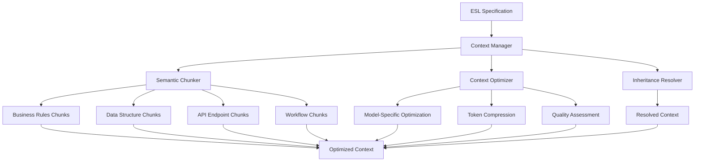

# Context Management System

The ESL Framework's **Context Management System** provides intelligent optimization of ESL specifications for AI consumption. It transforms large, complex specifications into optimized contexts that different AI models can process efficiently while preserving semantic relationships and business logic.

## Table of Contents

- [Overview](#overview)
- [Architecture](#architecture)
- [Core Components](#core-components)
- [Context Creation](#context-creation)
- [Semantic Chunking](#semantic-chunking)
- [AI Model Optimization](#ai-model-optimization)
- [Streaming Context](#streaming-context)
- [Context Analysis](#context-analysis)
- [Performance Optimization](#performance-optimization)
- [Advanced Features](#advanced-features)
- [Best Practices](#best-practices)
- [API Reference](#api-reference)

## Overview

The Context Management System solves the problem of feeding large ESL specifications to AI models by:

- **Intelligent Chunking**: Breaking down specifications while preserving relationships
- **Model-Specific Optimization**: Tailoring format and structure for different AI models
- **Token Management**: Precise estimation and compression for optimal token usage
- **Semantic Preservation**: Maintaining business logic and relationships during optimization
- **Streaming Support**: Real-time processing of massive specifications

### Key Benefits

- **50%+ Token Reduction**: Intelligent compression without losing meaning
- **Relationship Preservation**: Maintains business logic connections
- **Multi-Model Support**: Optimized for GPT-4, Claude-3, Gemini, and more
- **Streaming Capability**: Handle specifications with 100+ models efficiently
- **Quality Assurance**: Built-in quality scoring and optimization suggestions

## Architecture



## Core Components

### 1. Context Manager

Central orchestrator that coordinates all context operations:

```typescript
import { ContextManager } from 'esl-framework';

const contextManager = new ContextManager({
  maxTokens: 8000,
  compressionLevel: 'medium',
  targetModel: 'gpt-4',
  enableCaching: true
});
```

### 2. Semantic Chunker

Intelligent document splitting that preserves relationships:

```typescript
import { SemanticChunker } from 'esl-framework';

const chunker = new SemanticChunker();
const chunks = await chunker.chunkByStrategy(document, {
  name: 'semantic',
  maxChunkSize: 2000,
  preserveRelationships: true
});
```

### 3. Context Optimizer

AI model-specific optimization engine:

```typescript
import { ContextOptimizer } from 'esl-framework';

const optimizer = new ContextOptimizer();
const optimizedContext = await optimizer.optimizeForModel(context, 'claude-3');
```

## Context Creation

### Basic Context Creation

```bash
# Create basic context
esl context create my-spec.esl.yaml

# Create with specific model
esl context create my-spec.esl.yaml --model gpt-4 --tokens 8000

# Create with high compression
esl context create my-spec.esl.yaml --compression high
```

### Programmatic Context Creation

```typescript
import { ContextManager } from 'esl-framework';

const contextManager = new ContextManager({
  maxTokens: 8000,
  compressionLevel: 'medium',
  targetModel: 'gpt-4',
  priorityFields: ['businessRules', 'dataStructures']
});

// Create optimized context
const context = await contextManager.createContext(eslDocument);

// Context includes:
// - Optimized document structure
// - Token estimation
// - Performance metrics
// - Relationship mapping
```

### Context Structure

```typescript
interface ProcessingContext {
  id: string;
  document: ESLDocument;
  filePath: string;
  basePath: string;
  metadata: {
    created: string;
    tokenBudget: number;
    targetModel: string;
    compressionLevel: string;
  };
  relationships: Map<string, string[]>;
  dependencies: Set<string>;
  performance: {
    parseTime: number;
    validationTime: number;
    optimizationTime: number;
    totalTime: number;
  };
  optimization?: {
    applied: boolean;
    originalTokens: number;
    finalTokens: number;
    techniques: string[];
  };
}
```

## Semantic Chunking

### Chunking Strategies

#### 1. Business Rules Chunking

```bash
# Chunk by business rule dependencies
esl context chunk my-spec.esl.yaml --strategy business_rules --tokens 2000
```

Groups related business rules together:

```typescript
// Example output
{
  "chunkId": "br_1",
  "content": {
    "businessRules": [
      {
        "id": "user-validation",
        "condition": "user.age >= 18",
        "action": "allowRegistration()"
      },
      {
        "id": "premium-user",
        "condition": "user.type === 'premium'",
        "action": "grantPremiumAccess()"
      }
    ]
  },
  "relationships": ["user-validation", "premium-user"],
  "tokenCount": 1847
}
```

#### 2. Data Structure Chunking

```bash
# Chunk by data model relationships
esl context chunk my-spec.esl.yaml --strategy data_structures --tokens 2500
```

Preserves composition hierarchies:

```typescript
// Groups related models
{
  "chunkId": "ds_1",
  "content": {
    "dataStructures": [
      {
        "id": "User",
        "fields": [
          { "name": "id", "type": "string" },
          { "name": "profile", "type": "UserProfile" }
        ]
      },
      {
        "id": "UserProfile",
        "fields": [
          { "name": "firstName", "type": "string" },
          { "name": "lastName", "type": "string" }
        ]
      }
    ]
  }
}
```

#### 3. API Endpoint Chunking

```bash
# Chunk by functional domains
esl context chunk my-spec.esl.yaml --strategy api_endpoints --tokens 2000
```

Groups endpoints by resource type:

```typescript
// Groups /users/* endpoints together
{
  "chunkId": "api_users",
  "content": {
    "apiEndpoints": [
      {
        "path": "/api/users",
        "method": "POST",
        "description": "Create user"
      },
      {
        "path": "/api/users/:id",
        "method": "GET",
        "description": "Get user by ID"
      }
    ]
  }
}
```

#### 4. Adaptive Chunking

```bash
# Automatically select optimal strategy
esl context chunk my-spec.esl.yaml --strategy adaptive --tokens 2000
```

Analyzes document structure and selects the best approach:

```typescript
// Analysis results
{
  "selectedStrategy": "data_structures",
  "reason": "Document has rich data model with 25+ structures",
  "confidence": 0.92,
  "alternatives": ["semantic", "business_rules"]
}
```

### Chunking Quality

```bash
# Validate chunk quality
esl context chunk my-spec.esl.yaml --validate --quality-threshold 0.8
```

Quality metrics include:
- **Relationship Preservation**: How well semantic connections are maintained
- **Token Efficiency**: Optimal token usage per chunk
- **Boundary Detection**: Clean breaking points
- **Dependency Completeness**: All dependencies included

## AI Model Optimization

### Supported Models

#### GPT-4
```bash
esl context optimize my-spec.esl.yaml --model gpt-4 --tokens 8192
```

Optimizations:
- Structured format with clear hierarchies
- Detailed descriptions for complex concepts
- Preserved metadata for context

#### Claude-3
```bash
esl context optimize my-spec.esl.yaml --model claude-3 --tokens 100000
```

Optimizations:
- Verbose format with comprehensive context
- Long-form descriptions
- Preserved relationships
- Optimized for large context windows

#### Gemini Pro
```bash
esl context optimize my-spec.esl.yaml --model gemini-pro --tokens 32768
```

Optimizations:
- Multimodal-friendly structure
- Clear separation of concerns
- Optimized for reasoning tasks

### Compression Techniques

#### Low Compression
```bash
esl context optimize my-spec.esl.yaml --compression low
```

- Minimal changes to original structure
- Preserves all optional metadata
- Removes only truly redundant information

#### Medium Compression
```bash
esl context optimize my-spec.esl.yaml --compression medium
```

- Removes examples and detailed descriptions
- Compresses repetitive structures
- Maintains core business logic

#### High Compression
```bash
esl context optimize my-spec.esl.yaml --compression high
```

- Aggressive removal of optional content
- Structural optimization
- Focuses on high-priority elements only

### Token Estimation

```bash
# Estimate tokens for different models
esl context estimate my-spec.esl.yaml --all-models
```

```json
{
  "gpt-4": {
    "tokens": 7543,
    "cost": "$0.23",
    "efficiency": "good"
  },
  "claude-3": {
    "tokens": 7234,
    "cost": "$0.15",
    "efficiency": "excellent"
  },
  "gemini-pro": {
    "tokens": 7891,
    "cost": "$0.18",
    "efficiency": "good"
  }
}
```

## Streaming Context

### Real-time Processing

```bash
# Stream large specifications
esl context stream my-spec.esl.yaml --chunk-size 1500 --overlap 200
```

### Streaming Configuration

```typescript
const streamingOptions = {
  chunkSize: 1500,        // Tokens per chunk
  overlap: 200,           // Overlap between chunks
  preserveRelationships: true,
  priorityFields: ['businessRules', 'dataStructures']
};

// Stream processing
for await (const chunk of contextManager.streamContext(document, streamingOptions)) {
  // Process chunk in real-time
  const result = await processWithAI(chunk);
  console.log(`Processed chunk ${chunk.id}: ${result.status}`);
}
```

### Streaming Benefits

- **Memory Efficiency**: Process documents larger than available memory
- **Parallel Processing**: Multiple chunks can be processed simultaneously
- **Progressive Results**: Get results as they become available
- **Fault Tolerance**: Individual chunk failures don't stop the entire process

## Context Analysis

### Quality Assessment

```bash
# Analyze context quality
esl context analyze my-spec.esl.yaml --detailed
```

```json
{
  "qualityScore": 0.87,
  "tokenEfficiency": 0.73,
  "relationshipPreservation": 0.91,
  "suggestions": [
    "Consider increasing compression level for better token efficiency",
    "Some semantic relationships may be lost - review chunking strategy"
  ],
  "metrics": {
    "originalTokens": 12450,
    "optimizedTokens": 8932,
    "compressionRatio": 0.28,
    "semanticPreservation": 0.91
  }
}
```

### Quality Factors

- **Completeness**: All essential information preserved
- **Coherence**: Logical structure maintained
- **Efficiency**: Optimal token usage
- **Accuracy**: No information distortion
- **Usability**: Easy for AI models to process

## Performance Optimization

### Caching

```typescript
// Enable caching for repeated operations
const contextManager = new ContextManager({
  enableCaching: true
});

// Cache statistics
const stats = contextManager.getCacheStats();
console.log(`Cache size: ${stats.size}, Hit rate: ${stats.hitRate}`);
```

### Parallel Processing

```bash
# Enable parallel chunk processing
esl context chunk my-spec.esl.yaml --parallel --workers 4
```

### Memory Management

```bash
# Limit memory usage
esl context create my-spec.esl.yaml --max-memory 1GB --streaming
```

## Advanced Features

### Context Inheritance

```typescript
// Resolve inheritance chains
const derivedDocument = {
  extends: ['base-spec'],
  businessRules: [/* overrides */]
};

const context = await contextManager.createContext(derivedDocument);
// Automatically resolves inheritance and merges content
```

### Context Merging

```bash
# Merge multiple contexts
esl context merge context1.json context2.json --output merged-context.json
```

```typescript
// Programmatic merging
const contexts = [context1, context2, context3];
const mergedContext = await contextManager.mergeContexts(contexts, {
  maxTokens: 10000,
  preserveRelationships: true,
  deduplicateContent: true
});
```

### Custom Optimizers

```typescript
// Create custom optimization strategy
class CustomOptimizer implements OptimizationStep {
  name = 'custom_business_optimizer';
  
  async optimize(document: ESLDocument, options: OptimizationOptions) {
    // Custom optimization logic
    return {
      content: optimizedDocument,
      originalSize: originalTokens,
      compressedSize: newTokens,
      preservedElements: ['critical-rules'],
      removedElements: ['examples'],
      qualityScore: 0.92
    };
  }
}

// Register and use
contextManager.registerOptimizer(new CustomOptimizer());
```

## Best Practices

### 1. Choose Appropriate Chunking Strategy

```bash
# For rule-heavy specifications
esl context chunk my-spec.esl.yaml --strategy business_rules

# For data-heavy specifications
esl context chunk my-spec.esl.yaml --strategy data_structures

# For API-heavy specifications
esl context chunk my-spec.esl.yaml --strategy api_endpoints

# When unsure, use adaptive
esl context chunk my-spec.esl.yaml --strategy adaptive
```

### 2. Optimize for Your AI Model

```bash
# For GPT-4 (8K context)
esl context optimize my-spec.esl.yaml --model gpt-4 --tokens 6000

# For Claude-3 (100K context)
esl context optimize my-spec.esl.yaml --model claude-3 --tokens 90000 --compression low

# For Gemini Pro (32K context)
esl context optimize my-spec.esl.yaml --model gemini-pro --tokens 28000
```

### 3. Monitor Quality

```bash
# Set quality thresholds
esl context create my-spec.esl.yaml --min-quality 0.8

# Analyze before production use
esl context analyze my-spec.esl.yaml --detailed
```

### 4. Use Streaming for Large Documents

```bash
# For specifications with 50+ models
esl context stream my-spec.esl.yaml --chunk-size 2000

# For real-time processing
esl context stream my-spec.esl.yaml --streaming --workers 4
```

### 5. Cache for Performance

```typescript
// Enable caching in production
const contextManager = new ContextManager({
  enableCaching: true,
  maxCacheSize: 100 // MB
});

// Clear cache periodically
setInterval(() => {
  contextManager.clearCache();
}, 60000); // Every minute
```

## API Reference

### ContextManager

```typescript
class ContextManager {
  constructor(options: ContextManagerOptions);
  
  // Core methods
  createContext(document: ESLDocument, options?: Partial<ContextManagerOptions>): Promise<ProcessingContext>;
  chunkDocument(document: ESLDocument, chunkSize?: number): Promise<ContextChunk[]>;
  optimizeContext(context: ProcessingContext, targetTokens: number): Promise<ProcessingContext>;
  mergeContexts(contexts: ProcessingContext[], options?: MergeOptions): Promise<ProcessingContext>;
  
  // Streaming
  streamContext(document: ESLDocument, options?: Partial<StreamingOptions>): AsyncGenerator<ContextChunk>;
  
  // Analysis
  analyzeContext(context: ProcessingContext): Promise<ContextAnalysis>;
  
  // Cache management
  clearCache(): void;
  getCacheStats(): CacheStats;
}
```

### SemanticChunker

```typescript
class SemanticChunker {
  // Chunking strategies
  chunkByBusinessRules(document: ESLDocument, maxChunkSize?: number): Promise<ContextChunk[]>;
  chunkByDataStructures(document: ESLDocument, maxChunkSize?: number): Promise<ContextChunk[]>;
  chunkByAPIEndpoints(document: ESLDocument, maxChunkSize?: number): Promise<ContextChunk[]>;
  chunkByWorkflow(document: ESLDocument, maxChunkSize?: number): Promise<ContextChunk[]>;
  chunkByStrategy(document: ESLDocument, strategy: ChunkingStrategy): Promise<ContextChunk[]>;
  
  // Quality validation
  validateChunkRelationships(chunks: ContextChunk[]): Promise<ESLValidationResult>;
}
```

### ContextOptimizer

```typescript
class ContextOptimizer {
  // Optimization methods
  optimizeContext(context: ProcessingContext, options: OptimizationOptions): Promise<ProcessingContext>;
  optimizeForModel(context: ProcessingContext, modelName: string): Promise<ProcessingContext>;
  compressContent(content: any, targetRatio: number): Promise<CompressionResult>;
  
  // Token estimation
  estimateTokens(content: any): Promise<number>;
  
  // Quality assessment
  measureOptimization(before: ProcessingContext, after: ProcessingContext): Promise<OptimizationMetrics>;
}
```

## Configuration

### Global Configuration

```yaml
# ~/.eslrc.yaml
context:
  defaults:
    maxTokens: 8000
    compressionLevel: medium
    targetModel: gpt-4
    enableCaching: true
    
  models:
    gpt-4:
      maxTokens: 8192
      preferredFormat: structured
      
    claude-3:
      maxTokens: 100000
      preferredFormat: verbose
      
  chunking:
    defaultStrategy: adaptive
    maxChunkSize: 2000
    preserveRelationships: true
```

### Project Configuration

```yaml
# esl.config.yaml
context:
  priorityFields:
    - businessRules
    - dataStructures
    - governance
    
  optimization:
    enableSemanticAnalysis: true
    qualityThreshold: 0.8
    
  caching:
    enabled: true
    maxSize: 100MB
    ttl: 3600 # seconds
```

## Troubleshooting

### Common Issues

#### 1. Poor Quality Scores

```bash
# Check quality factors
esl context analyze my-spec.esl.yaml --detailed

# Try different chunking strategy
esl context chunk my-spec.esl.yaml --strategy semantic --quality-threshold 0.8
```

#### 2. Token Limit Exceeded

```bash
# Increase compression
esl context optimize my-spec.esl.yaml --compression high

# Use streaming
esl context stream my-spec.esl.yaml --chunk-size 1500
```

#### 3. Lost Relationships

```bash
# Use semantic chunking
esl context chunk my-spec.esl.yaml --strategy semantic --preserve-relationships

# Reduce chunk size
esl context chunk my-spec.esl.yaml --chunk-size 1000
```

#### 4. Performance Issues

```bash
# Enable caching
esl context create my-spec.esl.yaml --cache

# Use parallel processing
esl context chunk my-spec.esl.yaml --parallel
```

### Debug Mode

```bash
# Enable debug logging
DEBUG=esl:context esl context create my-spec.esl.yaml --verbose
```

---

The Context Management System ensures that your ESL specifications are optimally formatted and structured for AI consumption, enabling efficient processing while preserving the essential business logic and relationships.

*For more advanced usage patterns and integration examples, see the [API Reference](api-reference.md) and [Advanced Usage Guide](advanced-usage.md).*