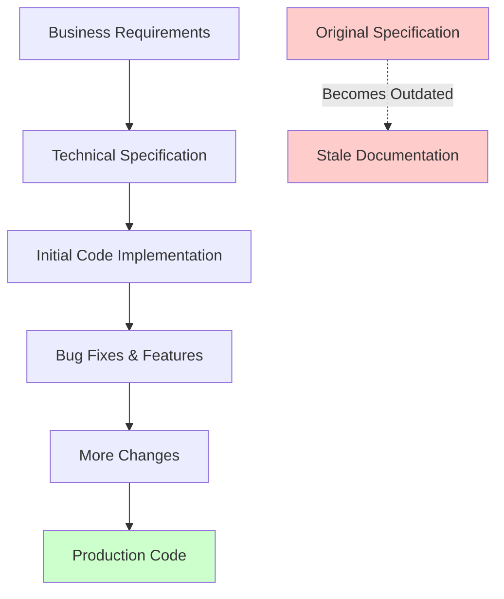
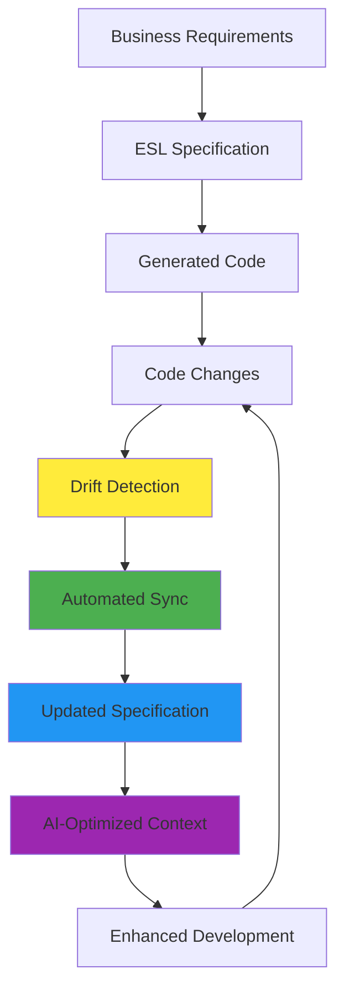

# The Problem ESL Framework Solves

## The Fundamental Challenge: Specification Drift

In modern software development, there's a critical disconnect between **what we plan to build** and **what we actually build**. This is known as **specification drift** - the inevitable divergence between business requirements documented in specifications and the actual implementation in code.

## The Traditional Development Cycle



### What Goes Wrong

1. **Initial Implementation**: Code is generated or written based on specifications
2. **Reality Hits**: Requirements change, bugs are discovered, features are added
3. **Code Evolves**: Developers modify code directly to meet real-world needs
4. **Specifications Forgotten**: Documentation becomes outdated and ignored
5. **Knowledge Loss**: New team members can't understand the system's intended behavior

## Real-World Impact

### The Cost of Specification Drift

#### For Development Teams
- **🔍 Debugging Nightmares**: Developers spend hours understanding code without reliable documentation
- **🔄 Refactoring Paralysis**: Fear of breaking undocumented behaviors slows down improvements
- **👥 Onboarding Delays**: New team members take weeks to understand legacy systems
- **🐛 Bug Reproduction**: Issues are hard to reproduce without understanding intended behavior

#### For Product Teams
- **📋 Feature Planning**: Difficult to plan new features without knowing current system capabilities
- **🎯 Requirement Gaps**: Business requirements and technical reality diverge over time
- **📊 Impact Analysis**: Hard to assess the impact of changes across the system
- **🔄 Regression Testing**: Incomplete understanding leads to inadequate testing

#### For Organizations
- **💰 Technical Debt**: Accumulation of undocumented changes creates maintenance burden
- **⚡ Slower Delivery**: Teams waste time reverse-engineering their own systems
- **🔒 Vendor Lock-in**: Lack of specifications makes system migration extremely difficult
- **📈 Scaling Challenges**: Growth is hampered by inability to understand and extend systems

## The Three Types of Drift

### 1. **Specification Lag** (Spec Behind Code)
```
Business Spec: v1.0 (3 months old)
Actual Code:   v1.7 (current)
```
- Developers implement features faster than specs are updated
- Business stakeholders lose visibility into actual system capabilities
- Risk of building features that conflict with existing implementation

### 2. **Implementation Lag** (Code Behind Spec)
```
Business Spec: v2.0 (approved, current)
Actual Code:   v1.5 (outdated)
```
- Specifications are updated but implementation hasn't caught up
- Business expects features that don't exist yet
- Risk of miscommunication about system capabilities

### 3. **Complete Divergence** (No Relationship)
```
Business Spec: Original plan from 6 months ago
Actual Code:   Evolved through multiple iterations
```
- Specifications and code have no meaningful relationship
- System behavior is understood only through code archaeology
- Business decisions are made with incorrect assumptions

## Industry Examples

### E-commerce Platform
**Problem**: An e-commerce platform's user authentication specification stated users could log in with email or username. After 6 months of development:
- **Specification**: Email OR username login
- **Actual Code**: Email AND phone number login, username deprecated
- **Result**: New OAuth integration failed because it was built against the outdated specification

### Healthcare System
**Problem**: A patient management system's API specification defined data retention policies:
- **Specification**: Patient data retained for 7 years
- **Actual Code**: Implementation retained data for 10 years due to regulatory changes
- **Result**: Compliance audit failed because the specification didn't reflect actual behavior

### Financial Services
**Problem**: A trading platform's risk management specification:
- **Specification**: Risk calculations performed every 5 minutes
- **Actual Code**: Calculations performed every 30 seconds due to market volatility
- **Result**: Audit trail didn't match actual system behavior, causing regulatory issues

## The AI Development Challenge

### Modern AI-Assisted Development
With the rise of AI-powered development tools (GitHub Copilot, ChatGPT, etc.), the specification drift problem has become even more critical:

#### Why AI Amplifies the Problem
1. **AI Needs Context**: AI tools work best with comprehensive, up-to-date specifications
2. **Code Generation Speed**: AI can generate code faster than humans can update specifications
3. **Consistency Requirements**: AI-generated code needs consistent patterns and standards
4. **Knowledge Transfer**: AI tools can't maintain institutional knowledge across team changes

#### The AI Specification Gap
```
AI Tool Input:   Outdated specification (v1.0)
AI Generated:   Code that conflicts with existing system (v1.5)
Developer Time: Hours debugging AI-generated conflicts
```

## Why Traditional Solutions Fail

### 1. **Documentation-Heavy Approaches**
- **Problem**: Documentation becomes a burden rather than a tool
- **Reality**: Developers skip documentation when under pressure
- **Result**: Documentation becomes even more outdated

### 2. **Manual Sync Processes**
- **Problem**: Requires discipline and time that teams don't have
- **Reality**: Manual processes are the first to be skipped during crunch time
- **Result**: Process breaks down when it's needed most

### 3. **Code-First Approaches**
- **Problem**: Business stakeholders can't understand technical code
- **Reality**: Code doesn't capture business intent and context
- **Result**: Business and technical teams work in isolation

### 4. **Spec-First Approaches**
- **Problem**: Specifications become ivory tower documents
- **Reality**: Implementation realities force code changes
- **Result**: Specifications become fiction rather than fact

## The Hidden Costs

### Quantifying Specification Drift

#### Developer Productivity Loss
- **Code Understanding**: 2-4 hours per developer per week
- **Debugging Time**: 30-50% longer debugging sessions
- **Feature Development**: 20-30% slower feature delivery
- **Code Review**: 40-60% more time spent on reviews

#### Business Impact
- **Feature Delivery**: 25-40% slower time-to-market
- **Quality Issues**: 50-70% more post-release bugs
- **Maintenance Costs**: 200-300% higher maintenance overhead
- **Team Turnover**: Higher developer frustration and turnover

#### Risk Factors
- **Regulatory Compliance**: Specifications don't match actual behavior
- **Security Vulnerabilities**: Undocumented changes create security gaps
- **Data Integrity**: Inconsistent understanding of data models
- **System Reliability**: Unclear failure modes and recovery procedures

## The Modern Software Landscape

### Microservices Complexity
- **Multiple Teams**: Each service has its own specification drift
- **API Contracts**: Inconsistent understanding of service interfaces
- **Data Flow**: Unclear data transformations between services
- **Deployment Dependencies**: Undocumented service dependencies

### Cloud-Native Challenges
- **Infrastructure as Code**: Configuration drift alongside application drift
- **Scaling Patterns**: Documented scaling behaviors don't match reality
- **Monitoring**: Alerts and metrics don't align with business expectations
- **Cost Management**: Resource usage doesn't match planned specifications

### DevOps Integration
- **CI/CD Pipelines**: Deployment processes don't match documented procedures
- **Environment Differences**: Staging and production configurations diverge
- **Rollback Procedures**: Recovery plans don't match actual system behavior
- **Monitoring**: Observability gaps due to specification-reality mismatches

## The ESL Framework Solution

### Addressing Root Causes

#### 1. **Automated Drift Detection**
- Continuously monitor for differences between specifications and code
- Provide immediate feedback when drift occurs
- Prevent small drifts from becoming large problems

#### 2. **Bidirectional Synchronization**
- Allow changes to flow both ways: spec-to-code and code-to-spec
- Maintain consistency regardless of where changes originate
- Preserve business intent while accommodating technical realities

#### 3. **AI-Optimized Context**
- Prepare specifications for AI consumption
- Ensure AI tools have accurate, up-to-date context
- Reduce AI-generated conflicts and inconsistencies

#### 4. **Integrated Workflow**
- Embed specification management into existing development workflows
- Make specification updates as easy as code changes
- Provide immediate value to encourage adoption

### Breaking the Cycle



## Success Stories

### Mid-Size SaaS Company
- **Before**: 3 hours per developer per week understanding legacy code
- **After**: 30 minutes per developer per week with ESL specifications
- **Result**: 40% faster feature delivery, 60% fewer post-release bugs

### Enterprise Financial Services
- **Before**: 6-week onboarding for new developers
- **After**: 2-week onboarding with comprehensive ESL specifications
- **Result**: 50% faster team scaling, better code quality

### Healthcare Startup
- **Before**: Failed compliance audit due to specification-reality gaps
- **After**: Continuous compliance monitoring with ESL drift detection
- **Result**: Passed audit with zero specification-related issues

## The Path Forward

The ESL Framework doesn't just solve specification drift—it transforms how teams think about the relationship between business requirements and technical implementation. By making specifications living, accurate documents that evolve with the codebase, ESL enables:

1. **Faster Development**: Developers spend time building, not deciphering
2. **Better Quality**: Specifications and code stay in sync automatically
3. **Improved Collaboration**: Business and technical teams work from the same source of truth
4. **Reduced Risk**: Regulatory compliance and security reviews based on accurate specifications
5. **Enhanced AI Integration**: AI tools work with precise, up-to-date context

The future of software development depends on maintaining the connection between business intent and technical implementation. ESL Framework provides the tools to make this connection not just possible, but automatic.

---

*For more information about how ESL Framework solves these challenges, see [The Value Proposition](The-Value-Proposition.md) and [What ESL Makes Easy](What-ESL-Makes-Easy.md).*