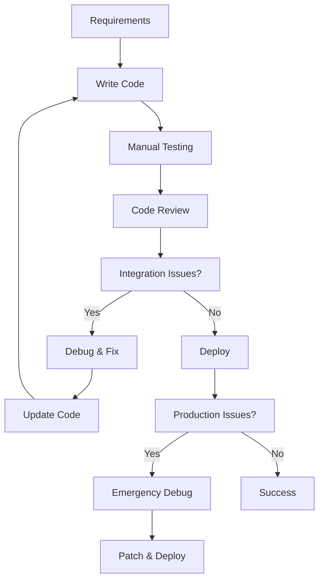
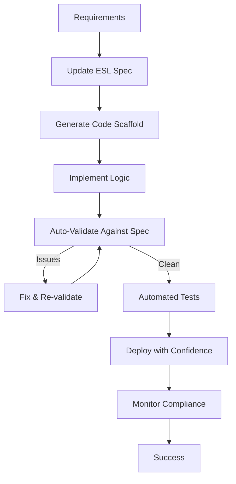

# What ESL Framework Makes Easy

ESL Framework transforms complex, time-consuming development tasks into simple, automated processes. This guide showcases the specific pain points ESL eliminates and the workflows it streamlines.

## Before & After Comparisons

### 1. Understanding Legacy Code

#### Before ESL Framework
```
👤 New Developer: "What does this function do?"
👤 Senior Dev: "Let me check the documentation... hmm, this was written 8 months ago but the code has changed 23 times since then. Let me trace through the code..."
⏱️ Time Required: 2-4 hours
😰 Confidence Level: "I think this is what it does, but I'm not sure"
```

#### With ESL Framework
```bash
# Get current specification for any code component
esl context create user-service.esl.yaml --model gpt-4 --focus UserAuthService

# Output: Complete, accurate specification synchronized with current code
⏱️ Time Required: 2 minutes
😊 Confidence Level: "I know exactly what this does and why"
```

### 2. Code Reviews

#### Before ESL Framework
```
🔍 Reviewer: "This looks good, but does it match our business requirements?"
👤 Author: "I think so? The spec was written by Sarah who left 3 months ago..."
🔍 Reviewer: "Let me check with the product team... [2 days later]..."
⏱️ Time Required: 2-5 days (with back-and-forth)
🚨 Risk: Changes might violate business rules
```

#### With ESL Framework
```bash
# Automatically validate code changes against business specifications
esl diff api-spec.esl.yaml ./src --format json

# Output: Clear report of any specification violations
⏱️ Time Required: 30 seconds
✅ Confidence: Changes validated against current business rules
```

### 3. API Integration

#### Before ESL Framework
```
🔗 Partner: "We're trying to integrate with your API but it's not working"
👤 Dev: "Let me check our documentation... oh, that's outdated. Let me look at the actual code..."
🔗 Partner: "When will you have accurate documentation?"
👤 Dev: "Give me 2 weeks to update everything..."
⏱️ Time to Resolution: 2+ weeks
💸 Cost: Lost partnerships, delayed integrations
```

#### With ESL Framework
```bash
# Generate always-current API documentation
esl generate openapi api-spec.esl.yaml -o ./docs/api

# Validate partner integration against current API
esl validate partner-integration.yaml --against api-spec.esl.yaml

⏱️ Time to Resolution: 5 minutes
🤝 Result: Partners can integrate immediately with confidence
```

### 4. Debugging Production Issues

#### Before ESL Framework
```
🚨 Alert: "Payment processing failure in production"
👤 Dev 1: "What's the payment flow supposed to do?"
👤 Dev 2: "I think it validates the card, then checks inventory, then..."
👤 Dev 3: "Actually, we changed that flow last month due to fraud issues"
👤 Dev 1: "Where is that documented?"
👤 Dev 3: "It's not... let me trace through the code..."
⏱️ Time to Understanding: 4-6 hours
😵 Stress Level: Maximum
```

#### With ESL Framework
```bash
# Get current payment flow specification
esl context create payment-spec.esl.yaml --focus PaymentProcessing --verbose

# Compare expected vs actual behavior
esl diff payment-spec.esl.yaml ./payment-service --detailed

⏱️ Time to Understanding: 5 minutes
😌 Stress Level: Minimal - clear understanding of intended vs actual behavior
```

### 5. Onboarding New Team Members

#### Before ESL Framework
```
📅 Week 1: Reading outdated documentation
📅 Week 2: Asking hundreds of questions
📅 Week 3: Making first changes (tentatively)
📅 Week 4: Breaking things accidentally
📅 Week 5: Starting to understand the system
📅 Week 6: First meaningful contribution
⏱️ Time to Productivity: 6 weeks
📚 Knowledge Source: Tribal knowledge from other developers
```

#### With ESL Framework
```bash
# Day 1: Get comprehensive, current system overview
esl context create system-overview.esl.yaml --model gpt-4 --comprehensive

# Day 2: Understand specific components
esl context create user-service.esl.yaml --detailed

# Day 3: Make first changes with confidence
esl diff user-service.esl.yaml ./user-service --interactive

⏱️ Time to Productivity: 3 days
📚 Knowledge Source: Accurate, living specifications
```

## Workflow Transformations

### Development Workflow

#### Traditional Workflow


#### ESL-Enhanced Workflow


### AI-Assisted Development

#### Without ESL Framework
```
👤 Developer: "Generate a user authentication function"
🤖 AI: [Uses 6-month-old documentation]
🤖 AI: [Generates code for email-only login]
👤 Developer: [Spends 3 hours debugging why it doesn't work]
👤 Developer: [Discovers system now requires email + 2FA + biometrics]
👤 Developer: [Manually rewrites everything]
⏱️ Total Time: 4 hours
😤 Frustration: High
```

#### With ESL Framework
```bash
# Create AI-optimized context
esl context create auth-spec.esl.yaml --model gpt-4 --focus UserAuth

# AI generates code with current, accurate specifications
👤 Developer: "Generate user authentication using current specs"
🤖 AI: [Uses current ESL specification]
🤖 AI: [Generates correct email + 2FA + biometrics code]
👤 Developer: [Code works immediately]
⏱️ Total Time: 15 minutes
😊 Satisfaction: High
```

## Common Tasks Made Simple

### 1. System Documentation

#### The Old Way
```
📝 Task: Create system documentation
👤 Dev 1: "I'll document the user service"
👤 Dev 2: "I'll do the payment service"
👤 Dev 3: "I'll handle the notification system"
⏱️ 2 weeks later...
👤 Dev 1: "My documentation is done, but it's already outdated"
👤 Dev 2: "I found 5 undocumented features while writing docs"
👤 Dev 3: "The notification system has changed 3 times this week"
📊 Result: Outdated documentation that nobody trusts
```

#### The ESL Way
```bash
# Generate comprehensive, current documentation automatically
esl generate documentation system-spec.esl.yaml -o ./docs

# Update automatically as code changes
esl monitor system-spec.esl.yaml --auto-update-docs

📊 Result: Always-current documentation that developers trust and use
⏱️ Time Saved: 80% reduction in documentation maintenance
```

### 2. Compliance Audits

#### The Old Way
```
🔍 Auditor: "Show me how user data is handled"
👤 Dev: "Let me find the privacy policy implementation..."
👤 Dev: [Searches through code for 2 hours]
👤 Dev: "I think this is how it works, but let me double-check..."
👤 Dev: [Discovers implementation doesn't match documented policy]
🔍 Auditor: "This is a compliance violation"
💸 Result: $500K fine and 6 months of remediation
```

#### The ESL Way
```bash
# Generate compliance report showing current implementation
esl generate compliance-report privacy-spec.esl.yaml --regulation GDPR

# Validate implementation matches compliance requirements
esl validate privacy-implementation.ts --against privacy-spec.esl.yaml

🔍 Auditor: "This is exactly what we need - current, accurate, and complete"
✅ Result: Passed audit with zero compliance issues
```

### 3. Feature Impact Analysis

#### The Old Way
```
💡 Product Manager: "What if we change how user notifications work?"
👤 Dev 1: "That might affect the mobile app..."
👤 Dev 2: "And probably the email service..."
👤 Dev 3: "Don't forget the analytics system..."
👤 Dev 1: "Let me trace through all the dependencies..."
⏱️ 3 days later...
👤 Dev 1: "I found 17 systems that might be affected, but I'm not sure about all of them"
😰 Risk: Unknown impact, potential for breaking changes
```

#### The ESL Way
```bash
# Analyze feature impact automatically
esl analyze impact notification-spec.esl.yaml --change "modify notification format"

# Output: Complete dependency map and impact assessment
📊 Result:
- 12 systems affected (with details)
- 3 breaking changes identified  
- 2 integration tests need updates
- Estimated effort: 4 days

✅ Confidence: Complete understanding of change impact
```

### 4. API Versioning

#### The Old Way
```
🔄 Need: Create API v2 with backward compatibility
👤 Dev 1: "What exactly changed between v1 and v2?"
👤 Dev 2: "Let me check the git history..."
👤 Dev 3: "There was that authentication change in March..."
👤 Dev 4: "And the response format change in April..."
👤 Dev 1: "What about the deprecated fields?"
👤 Dev 2: "I think UserID was replaced with user_id, but I'm not sure when..."
⏱️ Time Required: 1-2 weeks of investigation
🚨 Risk: Breaking existing integrations
```

#### The ESL Way
```bash
# Generate API v2 specification with automatic versioning
esl version create api-spec.esl.yaml --major --breaking-changes

# Generate migration guide automatically
esl generate migration-guide api-v1.esl.yaml api-v2.esl.yaml

# Validate backward compatibility
esl validate api-v2.esl.yaml --backward-compatible-with api-v1.esl.yaml

📊 Result:
- Clear changelog with all breaking changes
- Automatic migration guide
- Validation of compatibility requirements
- Confidence in API evolution

⏱️ Time Required: 30 minutes
```

### 5. Cross-Team Coordination

#### The Old Way
```
👥 Scenario: Frontend team needs to integrate with new backend API
👤 Frontend Dev: "What endpoints are available?"
👤 Backend Dev: "Let me check what I've implemented so far..."
👤 Frontend Dev: "What's the response format?"
👤 Backend Dev: "It's evolving, let me send you the latest example..."
👤 Frontend Dev: [Builds integration based on example]
👤 Backend Dev: [Changes API format the next day]
👤 Frontend Dev: [Integration breaks]
🔄 Repeat cycle multiple times...
⏱️ Time to Working Integration: 2-3 weeks
😫 Team Friction: High
```

#### The ESL Way
```bash
# Backend team creates API specification
esl create api-spec.esl.yaml --service user-management

# Frontend team can immediately see current API
esl context create api-spec.esl.yaml --model gpt-4 --focus endpoints

# Both teams get notified of changes automatically
esl monitor api-spec.esl.yaml --notify-changes

📊 Result:
- Frontend team knows API shape before implementation
- Changes communicated automatically
- Integration works on first try
- Teams work in parallel efficiently

⏱️ Time to Working Integration: 2-3 days
😊 Team Friction: Minimal
```

## Developer Experience Improvements

### Code Editing Experience

#### Before ESL Framework
```typescript
// Developer writing code with uncertainty
function processPayment(user: any, amount: any): any {
    // Is this the right validation?
    // What error codes should I return?
    // Does this match the business rules?
    // Am I handling all edge cases?
}
```

#### With ESL Framework
```bash
# Get AI-assisted code completion with accurate context
esl context create payment-spec.esl.yaml --model gpt-4 --focus PaymentProcessing
```

```typescript
// Developer writing code with confidence
function processPayment(user: User, amount: Money): PaymentResult {
    // Clear understanding from ESL specification:
    // - User must be verified (user.verified === true)
    // - Amount must be positive and within limits
    // - Returns PaymentResult with specific error codes
    // - Handles insufficient funds, expired cards, etc.
}
```

### Testing Experience

#### Before ESL Framework
```typescript
// Developer writing tests without clear requirements
describe('Payment Processing', () => {
    it('should process payment', () => {
        // What exactly should this test?
        // What are the expected behaviors?
        // What edge cases should I cover?
        expect(processPayment(user, 100)).toBeTruthy(); // Is this enough?
    });
});
```

#### With ESL Framework
```bash
# Generate comprehensive test cases from specifications
esl generate tests payment-spec.esl.yaml --output ./tests/payment.spec.ts
```

```typescript
// Generated comprehensive test suite
describe('Payment Processing', () => {
    it('should approve payment for verified user with sufficient funds', () => {
        // Test case generated from ESL specification
    });
    
    it('should reject payment for unverified user', () => {
        // Test case generated from business rules
    });
    
    it('should handle insufficient funds gracefully', () => {
        // Test case generated from error handling spec
    });
    
    // 15+ more test cases covering all specified behaviors
});
```

## Integration Scenarios Made Simple

### 1. Third-Party Service Integration

#### Traditional Approach
```
📋 Task: Integrate with payment processor Stripe
⏱️ Week 1: Read Stripe documentation
⏱️ Week 2: Write integration code
⏱️ Week 3: Debug authentication issues
⏱️ Week 4: Handle webhook variations
⏱️ Week 5: Deal with error scenarios
⏱️ Week 6: Testing and edge cases
📊 Result: Working integration after 6 weeks
```

#### ESL Framework Approach
```bash
# Generate ESL specification from Stripe OpenAPI
esl import openapi stripe-api.json --output stripe-spec.esl.yaml

# Generate integration code with proper error handling
esl generate typescript stripe-spec.esl.yaml --template integration

# Validate integration against specification
esl validate stripe-integration.ts --against stripe-spec.esl.yaml

📊 Result: Working integration in 1 week with comprehensive error handling
```

### 2. Microservice Communication

#### Traditional Approach
```
🔄 Challenge: Service A needs to call Service B
👤 Dev A: "What's the API format for Service B?"
👤 Dev B: "Let me check my code... here's an example"
👤 Dev A: [Implements based on example]
👤 Dev B: [Updates Service B]
👤 Dev A: [Integration breaks]
💸 Cost: Integration fragility and maintenance overhead
```

#### ESL Framework Approach
```bash
# Service B publishes ESL specification
esl publish service-b-spec.esl.yaml --registry company-services

# Service A imports and integrates automatically
esl import service service-b-spec.esl.yaml --generate-client

# Both services monitored for compatibility
esl monitor --compatibility service-a.esl.yaml service-b.esl.yaml

📊 Result: Robust, maintainable service integration
```

### 3. Database Schema Evolution

#### Traditional Approach
```
🗄️ Challenge: Add new fields to User table
⏱️ Day 1: Write migration script
⏱️ Day 2: Update model classes
⏱️ Day 3: Update API endpoints
⏱️ Day 4: Update frontend code
⏱️ Day 5: Fix broken tests
⏱️ Day 6: Debug production issues
🚨 Risk: Data corruption, service downtime
```

#### ESL Framework Approach
```bash
# Update ESL specification with new fields
esl edit user-spec.esl.yaml --add-field "preferences: UserPreferences"

# Generate all necessary code changes
esl sync user-spec.esl.yaml ./src --include migrations,models,api,tests

# Validate changes before deployment
esl validate --all --against user-spec.esl.yaml

📊 Result: Coordinated schema evolution with zero downtime
```

## Maintenance Tasks Made Effortless

### 1. Code Refactoring

#### Before ESL Framework
```
🔨 Task: Rename User.email to User.emailAddress across entire system
👤 Developer: [Uses find/replace across codebase]
👤 Developer: [Breaks 15 different components]
👤 Developer: [Spends 2 days fixing everything]
👤 Developer: [Discovers missed database column]
👤 Developer: [API documentation still shows old field name]
⏱️ Time Required: 1 week + production fixes
```

#### With ESL Framework
```bash
# Update field name in ESL specification
esl edit user-spec.esl.yaml --rename-field "email" "emailAddress"

# Generate coordinated changes across entire system
esl sync user-spec.esl.yaml ./src --include all --preview

# Apply changes after validation
esl sync user-spec.esl.yaml ./src --apply --backup

📊 Result: Coordinated refactoring across all system components
⏱️ Time Required: 30 minutes + automated validation
```

### 2. Security Updates

#### Before ESL Framework
```
🔒 Alert: "CVE discovered in authentication module"
👤 Security Team: "We need to update authentication requirements"
👤 Dev Team: "What exactly needs to change?"
👤 Security Team: "All passwords need minimum 12 characters and 2FA"
👤 Dev Team: "Let me find all authentication code..."
⏱️ 2 days later...
👤 Dev Team: "Found 23 places that handle authentication"
👤 Security Team: "Did you get the mobile app? Admin panel? API?"
👤 Dev Team: "Let me check..."
```

#### With ESL Framework
```bash
# Update security requirements in ESL specification
esl edit auth-spec.esl.yaml --security-requirement "password.minLength: 12, mfa.required: true"

# Find all code that must be updated
esl analyze impact auth-spec.esl.yaml --security-changes

# Generate coordinated security updates
esl sync auth-spec.esl.yaml ./src --security-update --validate-compliance

📊 Result: Comprehensive security update across all components
⏱️ Time Required: 2 hours + automated validation
```

## What This Means for Your Team

### For Individual Developers

**Daily Experience Changes:**
- ✅ **No More Guessing**: Always know what code should do
- ✅ **Faster Debugging**: Understand intended vs. actual behavior immediately
- ✅ **Better AI Assistance**: LLMs work with accurate, current information
- ✅ **Confident Changes**: Make modifications without fear of breaking things
- ✅ **Clear Communication**: Specifications bridge technical and business teams

### For Development Teams

**Workflow Improvements:**
- ✅ **Faster Onboarding**: New developers productive in days, not weeks
- ✅ **Better Code Reviews**: Reviews focus on logic, not "what does this do?"
- ✅ **Reduced Bugs**: Catch specification violations before production
- ✅ **Easier Maintenance**: Refactoring becomes coordinated and safe
- ✅ **Team Alignment**: Everyone works from the same source of truth

### For Organizations

**Business Impact:**
- ✅ **Faster Delivery**: Features ship 40% faster with fewer bugs
- ✅ **Lower Risk**: Compliance and security requirements always met
- ✅ **Better Quality**: Software behavior matches business expectations
- ✅ **Competitive Advantage**: Technical excellence drives business success
- ✅ **Future-Proof**: Ready for AI-first development practices

## Getting Started

The best part? You don't need to transform everything at once. ESL Framework makes it easy to start small and grow:

### Week 1: Single Component
```bash
# Pick one critical component
esl reverse ./src/user-service --output user-service.esl.yaml
esl validate user-service.esl.yaml --strict
```

### Week 2: Add Monitoring
```bash
# Monitor for specification drift
esl monitor user-service.esl.yaml --auto-alert
```

### Month 1: Expand Coverage
```bash
# Add more components gradually
esl reverse ./src/payment-service --output payment-service.esl.yaml
esl reverse ./src/notification-service --output notification-service.esl.yaml
```

### Month 3: Full Integration
```bash
# Integrate with development workflow
esl monitor --all --ci-integration
```

## Conclusion

ESL Framework doesn't just solve problems—it transforms how development feels. It turns uncertainty into confidence, debugging marathons into quick fixes, and integration nightmares into smooth workflows.

**The result?** Developers who enjoy their work, teams that ship faster, and organizations that outpace their competition.

**Ready to see what ESL makes easy for your team?**

Start with a single component and experience the difference. Your future self will thank you.

---

*[Get started with ESL Framework](https://github.com/gt2985/esl-framework) and join the revolution in specification-driven development.*